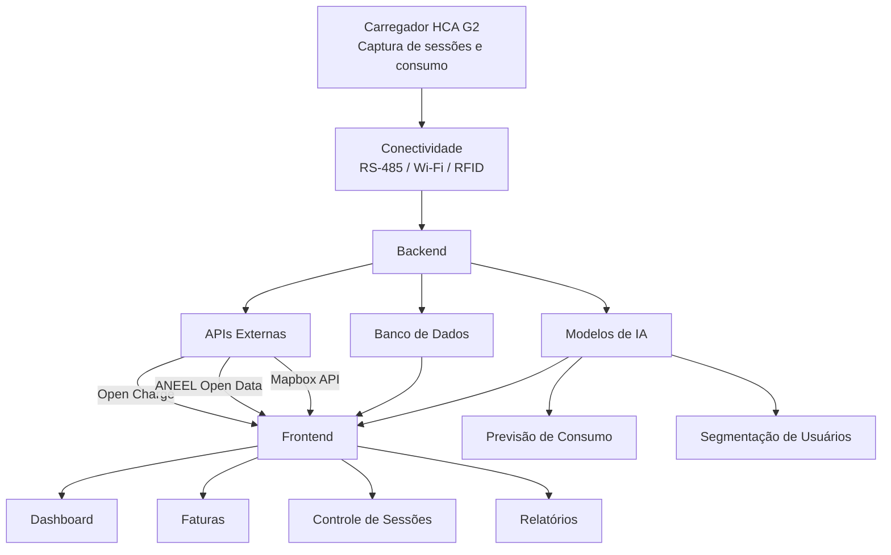

# GOODWE

## 👥 Equipe

| Nome | RM |
|------|----|
| Ana Gabriela     | rm571312 |
| Kaique           | rm570533 |
| Miguel Antunes   | rm573643 |
| Miguel Gonçalves | rm573793 |

## Descrição do Problema e Contexto
### O Problema
Com o crescimento da mobilidade elétrica, a infraestrutura de recarga compartilhada em condomínios e prédios corporativos enfrenta desafios significativos. Atualmente, não existem mecanismos eficazes para estruturar sessões de recarga, calcular o consumo individual de cada usuário e oferecer uma experiência digital clara e intuitiva. Isso gera dificuldades na gestão, rateio de custos e na transparência para os usuários.

### O Contexto
Este projeto é desenvolvido no âmbito da parceria GoodWe + FIAP, com o objetivo de transformar dados brutos de sessões de recarga em informações estruturadas e inteligentes. A plataforma EV ChargeOps visa oferecer uma solução completa para a gestão operacional de estações de recarga, integrando hardware, software e inteligência artificial para otimizar o uso e a cobrança justa dos serviços.

## Frente 1: Análise de Mercado (Opção A)

### Zaptec: 
 Plataforma que oferece carregadores inteligentes com monitoramento em tempo real e modelo de cobrança por assinatura.
### Wallbox:
 Solução com foco em carregamento residencial e corporativo, com funcionalidades de controle remoto e integração com sistemas de energia renovável.
### Neocharge:
 Plataforma que permite o rateio automático do consumo de energia entre usuários, com interface digital para gestão e pagamentos.
Cada solução apresenta diferentes abordagens para o problema, com vantagens e limitações que foram consideradas para o desenvolvimento do EV ChargeOps.

## Frente 2: Base Regulatória e Técnica - Mapeamento de APIs Complementares (Opção C)

### Open Charge Map API:
 API pública que oferece dados sobre estações de recarga em todo o mundo, incluindo localização, tipos de conectores e disponibilidade. Essa API pode ser integrada para fornecer informações adicionais sobre pontos de recarga próximos, ampliando a experiência do usuário.
 
### ANEEL Open Data API:
Plataforma de dados abertos da Agência Nacional de Energia Elétrica, que disponibiliza informações oficiais sobre tarifas de energia, distribuidoras, consumo e indicadores do setor elétrico brasileiro. Pode ser utilizada para enriquecer análises de consumo energético, apoiar cálculos de custos de recarga e fornecer dados regulatórios confiáveis para o sistema.

### Mapbox API:
Plataforma de mapas e geolocalização que permite exibir mapas interativos, localizar estações de recarga, calcular rotas e converter endereços em coordenadas geográficas. Sua integração pode facilitar a visualização dos pontos de recarga e melhorar a navegação dos usuários até as estações disponíveis.
## Frente 3: Arquitetura e IA - Definição do Papel da IA (Opção B)
A inteligência artificial desempenha um papel central na otimização e personalização da experiência do EV ChargeOps. As duas abordagens principais escolhidas são:

Previsão de Demanda (Regressão): Utilizando modelos de regressão, a IA prevê os horários de maior demanda para otimizar o uso dos carregadores, evitando sobrecargas e melhorando a eficiência energética. Essa previsão permite também ajustar preços dinamicamente conforme o consumo esperado.
Clustering para Segmentação de Usuários: Aplicando técnicas de clustering (como K-Means), a IA segmenta os usuários em perfis distintos (por exemplo, residentes frequentes versus visitantes ocasionais). Essa segmentação possibilita oferecer planos personalizados e melhorar o gerenciamento do uso compartilhado.
Essas abordagens utilizam dados históricos de consumo, horários de uso e características dos usuários para treinar os modelos, impactando positivamente a gestão e a satisfação dos usuários.

## Arquitetura da Solução
### Diagrama

#### Carregador HCA G2: Captura dados de sessões de recarga e consumo.
#### Conectividade: Comunicação via RS-485, Wi-Fi e RFID para transmissão dos dados ao backend.
#### Backend: Processamento dos dados, aplicação dos modelos de IA para previsão e segmentação, e cálculo do rateio.
#### Frontend: Interface para gestores e usuários, exibindo informações de consumo, faturas e controle de sessões.

## Modelo de Rateio
O modelo de rateio adotado é baseado no consumo real de energia de cada usuário, garantindo justiça e transparência:

#### Consumo em kWh por sessão.
#### Tempo de ocupação da vaga de recarga.
#### Tarifas fixas e variáveis conforme o custo da energia.
Esse modelo permite que cada usuário pague exatamente pelo que consumiu, evitando conflitos e incentivando o uso consciente.

## Modo de pagamento

### Gift Card (Créditos Pré-Pagos)

O usuário adiciona créditos à sua conta antes de utilizar os carregadores. O funcionamento é semelhante ao de um gift card ou carteira digital.

Exemplos de recarga de saldo:

- R$ 50,00
- R$ 100,00
- R$ 200,00

Ao final de cada sessão de recarga, o sistema calcula automaticamente o valor consumido e desconta do saldo disponível do usuário.

#### Vantagens
- Controle total dos gastos;
- Sem cobranças inesperadas;
- Pagamento antecipado;
- Facilidade para visitantes e usuários temporários.

### Pagamento Mensal (Pós-Pago)

Nesta modalidade, todas as sessões realizadas durante o mês são registradas pela plataforma.

Ao final do período, o sistema gera uma fatura contendo:

- Quantidade de sessões realizadas;
- Consumo total em kWh;
- Tempo de utilização dos carregadores;
- Valor total a ser pago.

A cobrança é realizada apenas no fechamento do mês, permitindo que o usuário utilize os carregadores sem a necessidade de manter créditos disponíveis.

#### Vantagens
- Maior comodidade para usuários frequentes;
- Pagamento consolidado em uma única fatura;
- Melhor acompanhamento do consumo mensal;
- Processo semelhante a contas tradicionais de serviços.
  
## Plano para a Sprint 02
