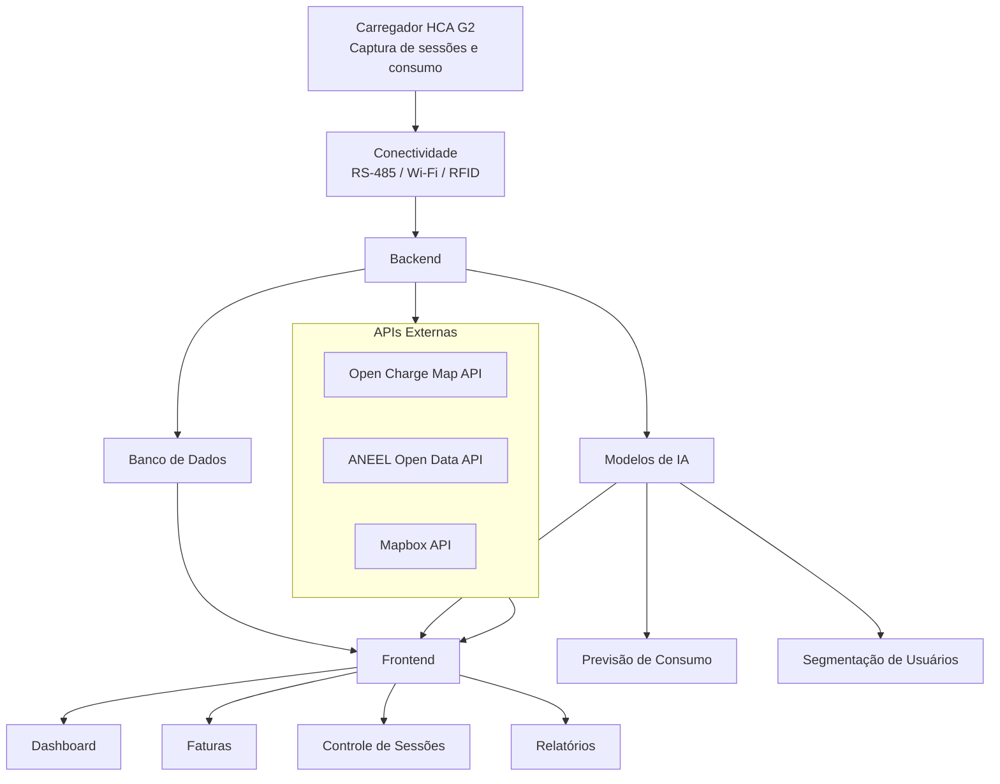

# GOODWE

## 👥 Equipe

| Nome | RM |
|------|----|
| Ana Gabriela     | rm571312 |
| Kaique           | rm570533 |
| Miguel Antunes   | rm573643 |
| Miguel Gonçalves | rm573793 |

## Descrição do Problema e Contexto
### O Problema
Com o crescimento da mobilidade elétrica, a infraestrutura de recarga compartilhada em condomínios e prédios corporativos enfrenta desafios significativos. Atualmente, não existem mecanismos eficazes para estruturar sessões de recarga, calcular o consumo individual de cada usuário e oferecer uma experiência digital clara e intuitiva. Isso gera dificuldades na gestão, rateio de custos e na transparência para os usuários.

### O Contexto
Este projeto é desenvolvido no âmbito da parceria GoodWe + FIAP, com o objetivo de transformar dados brutos de sessões de recarga em informações estruturadas e inteligentes. A plataforma EV ChargeOps visa oferecer uma solução completa para a gestão operacional de estações de recarga, integrando hardware, software e inteligência artificial para otimizar o uso e a cobrança justa dos serviços.

## Frente 1: Análise de Mercado (Opção A)

### Zaptec: 
 Plataforma que oferece carregadores inteligentes com monitoramento em tempo real e modelo de cobrança por assinatura.
### Wallbox:
 Solução com foco em carregamento residencial e corporativo, com funcionalidades de controle remoto e integração com sistemas de energia renovável.
### Neocharge:
 Plataforma que permite o rateio automático do consumo de energia entre usuários, com interface digital para gestão e pagamentos.
Cada solução apresenta diferentes abordagens para o problema, com vantagens e limitações que foram consideradas para o desenvolvimento do EV ChargeOps.

## Frente 2: Base Regulatória e Técnica - Mapeamento de APIs Complementares (Opção C)

### Open Charge Map API

A Open Charge Map é uma API pública e colaborativa que fornece informações sobre estações de recarga para veículos elétricos em todo o mundo. A plataforma disponibiliza dados como localização geográfica, tipos de conectores, potência dos carregadores e informações operacionais das estações.

**Objetivo no projeto:**
Integrar informações de pontos de recarga próximos ao usuário, ampliando a experiência de navegação e fornecendo dados adicionais sobre a infraestrutura de carregamento disponível.

**Principais funcionalidades:**
- Localização de estações de recarga.
- Consulta de tipos de conectores.
- Informações sobre potência dos carregadores.
- Cobertura internacional.
- Dados atualizados pela comunidade global.

**Benefícios:**
- API gratuita e aberta.
- Fácil integração.
- Grande quantidade de estações cadastradas.

---

### ANEEL Open Data API

A ANEEL Open Data API disponibiliza dados públicos do setor elétrico brasileiro por meio da plataforma de Dados Abertos da Agência Nacional de Energia Elétrica (ANEEL). Os dados incluem informações sobre tarifas, distribuidoras, geração, transmissão e consumo de energia.

**Objetivo no projeto:**
Utilizar informações oficiais do setor elétrico para complementar análises de consumo energético, custos de recarga e indicadores regulatórios.

**Principais funcionalidades:**
- Consulta de tarifas de energia.
- Informações sobre distribuidoras.
- Dados de geração e consumo energético.
- Indicadores regulatórios do setor elétrico.

**Benefícios:**
- Fonte oficial do Governo Federal.
- Dados confiáveis e atualizados.
- Suporte para análises energéticas e financeiras.

---

### Mapbox API

A Mapbox é uma plataforma de geolocalização e mapas que oferece recursos para criação de mapas interativos, navegação, geocodificação e cálculo de rotas. A API permite integrar visualizações geográficas modernas em aplicações web e mobile.

**Objetivo no projeto:**
Exibir estações de recarga em mapas interativos e facilitar a navegação dos usuários até os pontos de carregamento disponíveis.

**Principais funcionalidades:**
- Mapas interativos.
- Geocodificação de endereços.
- Cálculo de rotas.
- Busca por locais e pontos de interesse.
- Visualização geográfica personalizada.

**Benefícios:**
- Interface moderna e intuitiva.
- Alto nível de personalização.
- Suporte para aplicações web e mobile.

---

## Integração das APIs na Arquitetura

| API | Finalidade |
|------|------------|
| Open Charge Map API | Consulta de estações de recarga e informações dos carregadores |
| ANEEL Open Data API | Obtenção de dados energéticos e tarifários oficiais |
| Mapbox API | Visualização geográfica, mapas interativos e rotas |

## Arquitetura da Solução
### Diagrama

#### Carregador HCA G2: Captura dados de sessões de recarga e consumo.
#### Conectividade: Comunicação via RS-485, Wi-Fi e RFID para transmissão dos dados ao backend.
#### Backend: Processamento dos dados, aplicação dos modelos de IA para previsão e segmentação, e cálculo do rateio.
#### Frontend: Interface para gestores e usuários, exibindo informações de consumo, faturas e controle de sessões.

## Modelo de Rateio
O modelo de rateio adotado é baseado no consumo real de energia de cada usuário, garantindo justiça e transparência:

#### Consumo em kWh por sessão.
#### Tempo de ocupação da vaga de recarga.
#### Tarifas fixas e variáveis conforme o custo da energia.
Esse modelo permite que cada usuário pague exatamente pelo que consumiu, evitando conflitos e incentivando o uso consciente.

## Modo de pagamento

### Gift Card (Créditos Pré-Pagos)

O usuário adiciona créditos à sua conta antes de utilizar os carregadores. O funcionamento é semelhante ao de um gift card ou carteira digital.

Exemplos de recarga de saldo:

- R$ 50,00
- R$ 100,00
- R$ 200,00

Ao final de cada sessão de recarga, o sistema calcula automaticamente o valor consumido e desconta do saldo disponível do usuário.

#### Vantagens
- Controle total dos gastos;
- Sem cobranças inesperadas;
- Pagamento antecipado;
- Facilidade para visitantes e usuários temporários.

### Pagamento Mensal (Pós-Pago)

Nesta modalidade, todas as sessões realizadas durante o mês são registradas pela plataforma.

Ao final do período, o sistema gera uma fatura contendo:

- Quantidade de sessões realizadas;
- Consumo total em kWh;
- Tempo de utilização dos carregadores;
- Valor total a ser pago.

A cobrança é realizada apenas no fechamento do mês, permitindo que o usuário utilize os carregadores sem a necessidade de manter créditos disponíveis.

#### Vantagens
- Maior comodidade para usuários frequentes;
- Pagamento consolidado em uma única fatura;
- Melhor acompanhamento do consumo mensal;
- Processo semelhante a contas tradicionais de serviços.
  
## Plano para a Sprint 02
