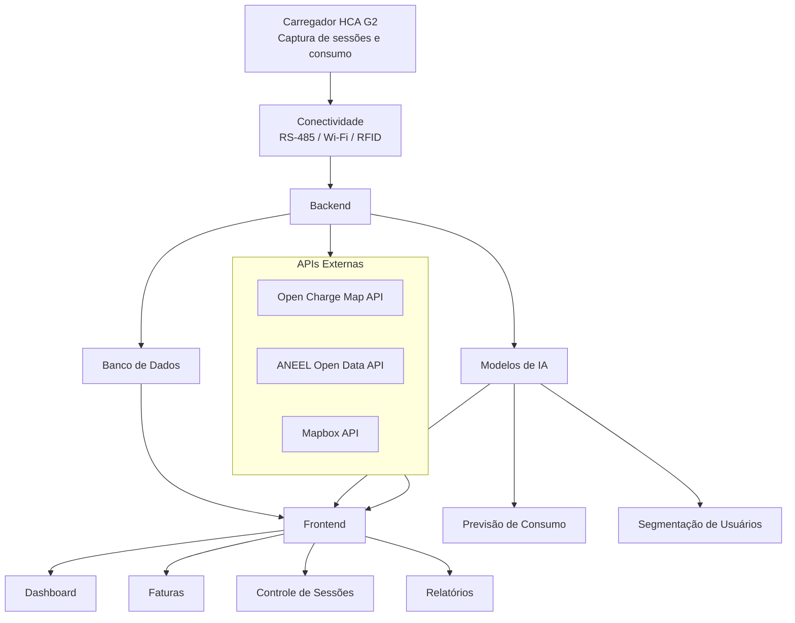

# GOODWE

## 👥 Equipe

| Nome | RM |
|------|----|
| Ana Gabriela     | rm571312 |
| Kaique           | rm570533 |
| Miguel Antunes   | rm573643 |
| Miguel Gonçalves | rm573793 |

## Descrição do Problema e Contexto
### O Problema
Com o crescimento da mobilidade elétrica, a infraestrutura de recarga compartilhada em condomínios e prédios corporativos enfrenta desafios significativos. Atualmente, não existem mecanismos eficazes para estruturar sessões de recarga, calcular o consumo individual de cada usuário e oferecer uma experiência digital clara e intuitiva. Isso gera dificuldades na gestão, rateio de custos e na transparência para os usuários.

### O Contexto
Este projeto é desenvolvido no âmbito da parceria GoodWe + FIAP, com o objetivo de transformar dados brutos de sessões de recarga em informações estruturadas e inteligentes. A plataforma EV ChargeOps visa oferecer uma solução completa para a gestão operacional de estações de recarga, integrando hardware, software e inteligência artificial para otimizar o uso e a cobrança justa dos serviços.

## Frente 1: Análise de Mercado (Opção A)

### Infraestruturas de Recarga Compartilhada

As infraestruturas de recarga compartilhada são ambientes onde um ou mais carregadores de veículos elétricos são utilizados por diversos usuários. Esse modelo é comum em condomínios residenciais, edifícios corporativos, universidades e estacionamentos compartilhados, onde não é viável instalar um carregador exclusivo para cada veículo.

O principal objetivo desse tipo de infraestrutura é otimizar custos, espaço físico e consumo energético, permitindo que vários usuários tenham acesso ao serviço de recarga.

### Principais Desafios Operacionais

Entre os principais desafios enfrentados pelos gestores estão:

- Identificação dos usuários que utilizam os carregadores;
- Controle das sessões de recarga;
- Monitoramento da disponibilidade dos equipamentos;
- Cálculo do consumo individual de energia;
- Rateio justo dos custos entre os usuários;
- Transparência na cobrança e geração de relatórios;
- Manutenção e monitoramento dos equipamentos.

Esses desafios tornam necessária a utilização de plataformas inteligentes capazes de registrar e analisar os dados gerados durante as recargas.

---

### Funcionamento de uma Sessão de Recarga

Uma sessão de recarga inicia quando o usuário conecta o veículo elétrico ao carregador. Após a autenticação do usuário, por aplicativo, cartão RFID ou outro método de identificação, o carregador libera o fornecimento de energia para o veículo.

Durante toda a sessão, o equipamento monitora e registra diversas informações operacionais. Ao final do carregamento ou quando o veículo é desconectado, a sessão é encerrada e os dados são armazenados para consulta e faturamento.

#### Dados Gerados Durante a Sessão

- Identificação do usuário;
- Data e horário de início;
- Data e horário de término;
- Duração da sessão;
- Energia consumida (kWh);
- Potência instantânea e média;
- Status da sessão;
- Eventos e possíveis falhas.

Esses dados podem ser capturados por meio da API do carregador, protocolos de comunicação como RS-485, conexões Wi-Fi ou LAN e armazenados em bancos de dados para posterior análise.

---

### Modelos de Negócio para Recarga Compartilhada

Atualmente existem diferentes modelos de negócio utilizados no Brasil e em outros países para gerenciar a cobrança da recarga de veículos elétricos.

#### Recarga Gratuita

O usuário utiliza o carregador sem qualquer cobrança. Esse modelo é comum em estabelecimentos que oferecem a recarga como benefício ou estratégia de atração de clientes.

#### Cobrança por kWh

O usuário paga apenas pela quantidade de energia efetivamente consumida durante a sessão. É considerado um dos modelos mais justos e transparentes.

#### Cobrança por Tempo

A cobrança é realizada com base no período em que o carregador permaneceu ocupado, independentemente da quantidade de energia consumida.

#### Assinatura Mensal

O usuário paga uma mensalidade fixa que lhe dá direito a utilizar os carregadores dentro de determinadas condições previamente estabelecidas.

#### Rateio Condominial

Os custos totais de energia são divididos entre os usuários com base em critérios definidos pelo condomínio, normalmente considerando o consumo individual registrado por cada sessão.

#### Créditos Pré-Pagos (Gift Card)

O usuário adiciona créditos à sua conta antes de utilizar os carregadores. A cada sessão de recarga, o valor correspondente ao consumo é descontado automaticamente do saldo disponível.

#### Pagamento Mensal (Pós-Pago)

Todas as sessões realizadas durante o mês são registradas pela plataforma e, ao final do período, é gerada uma fatura consolidada contendo o consumo total e o valor a ser pago pelo usuário.

---

### Zaptec: 
 Plataforma que oferece carregadores inteligentes com monitoramento em tempo real e modelo de cobrança por assinatura.
### Wallbox:
 Solução com foco em carregamento residencial e corporativo, com funcionalidades de controle remoto e integração com sistemas de energia renovável.
### Neocharge:
 Plataforma que permite o rateio automático do consumo de energia entre usuários, com interface digital para gestão e pagamentos.
Cada solução apresenta diferentes abordagens para o problema, com vantagens e limitações que foram consideradas para o desenvolvimento do EV ChargeOps.

## Frente 2: Base Regulatória e Técnica - Mapeamento de APIs Complementares (Opção C)

## Resolução Normativa ANEEL nº 1.000/2021

A Resolução Normativa nº 1.000/2021 da Agência Nacional de Energia Elétrica (ANEEL) estabelece as principais regras para instalação e operação de estações de recarga de veículos elétricos no Brasil.

Um dos pontos mais importantes para o projeto Volt Rate está relacionado à possibilidade de exploração comercial da recarga. De acordo com o Art. 554 da resolução, é permitida a recarga de veículos pertencentes a terceiros, inclusive para fins comerciais, com preços livremente negociados entre as partes. Dessa forma, condomínios, empresas e operadores privados podem oferecer serviços de recarga sem necessidade de autorização específica para comercialização da energia.

A norma também determina que a instalação de estações de recarga deve ser comunicada previamente à distribuidora de energia sempre que houver necessidade de nova conexão elétrica, aumento ou redução de carga instalada ou alteração do nível de tensão da unidade consumidora. Essa exigência busca garantir a segurança e a capacidade da rede elétrica local.

Outro aspecto relevante está previsto no Art. 552, que determina que equipamentos de recarga não exclusivos para uso privado devem ser compatíveis com protocolos abertos de domínio público para comunicação, supervisão e controle remotos. Essa exigência favorece a interoperabilidade entre carregadores e plataformas de gerenciamento, permitindo a integração com sistemas externos de monitoramento e cobrança.

Essas determinações regulatórias favorecem o desenvolvimento do Volt Rate, uma vez que a plataforma depende da coleta de dados dos carregadores para realizar monitoramento, cálculo de custos e geração de relatórios de consumo.

## Carregador GoodWe HCA G2

O carregador GoodWe HCA G2 foi selecionado como referência tecnológica por oferecer recursos de conectividade e monitoramento compatíveis com os objetivos do projeto. O equipamento suporta diferentes interfaces de comunicação, permitindo sua integração com sistemas externos e plataformas de gestão.

### RS-485

A interface RS-485 utiliza comunicação serial industrial e suporta o protocolo Modbus. Essa tecnologia permite que sistemas externos realizem a leitura de informações operacionais do carregador, como potência instantânea, estado de funcionamento e energia consumida. Para o Volt Rate, essa interface pode ser utilizada para integração direta com sistemas locais de monitoramento.

### LAN (Ethernet)

A conexão LAN permite que o carregador seja conectado diretamente à rede local da instalação. Por meio dessa interface, os dados podem ser enviados para servidores de monitoramento e plataformas de gerenciamento, oferecendo maior estabilidade de comunicação em comparação às conexões sem fio.

### Wi-Fi

A conectividade Wi-Fi possibilita a comunicação do carregador com a internet sem necessidade de cabeamento de rede. Essa funcionalidade permite o envio de informações para a plataforma SEMS+ e possibilita monitoramento remoto por aplicativos e sistemas em nuvem.

### Bluetooth

O Bluetooth é utilizado principalmente durante o processo de configuração inicial e manutenção do equipamento. Técnicos e administradores podem acessar parâmetros locais do carregador utilizando dispositivos móveis sem necessidade de conexão direta à internet.

### RFID

A tecnologia RFID permite a autenticação de usuários por meio de cartões ou tags de identificação. Essa funcionalidade é especialmente importante em ambientes compartilhados, pois possibilita registrar qual usuário iniciou cada sessão de recarga. No contexto do Volt Rate, o RFID pode ser utilizado para associar automaticamente o consumo energético ao respectivo usuário e realizar o rateio dos custos.

## API GoodWe (SEMS Portal)

O ecossistema GoodWe utiliza a plataforma SEMS (Smart Energy Management System) para monitoramento remoto de equipamentos conectados. A comunicação entre o carregador e a nuvem permite o armazenamento de informações operacionais que podem ser utilizadas por sistemas externos através de integrações autorizadas.

Entre os principais dados disponibilizados pelo sistema estão:

* Status operacional do carregador;
* Estado da sessão de carregamento;
* Potência instantânea de recarga;
* Energia acumulada entregue ao veículo;
* Histórico de consumo energético;
* Horários de início e término das sessões;
* Eventos de falha ou interrupção;
* Informações de autenticação e gerenciamento dos usuários.

Esses dados são fundamentais para o funcionamento do Volt Rate, pois permitem acompanhar o uso da infraestrutura em tempo real, gerar relatórios de consumo, calcular custos individuais e desenvolver análises baseadas em inteligência artificial.

A integração entre a regulamentação da ANEEL, os recursos de comunicação do GoodWe HCA G2 e os dados disponibilizados pela plataforma SEMS cria uma base tecnológica adequada para o desenvolvimento de soluções voltadas à gestão inteligente de carregadores compartilhados.

---

### Open Charge Map API

A Open Charge Map é uma API pública e colaborativa que fornece informações sobre estações de recarga para veículos elétricos em todo o mundo. A plataforma disponibiliza dados como localização geográfica, tipos de conectores, potência dos carregadores e informações operacionais das estações.

**Objetivo no projeto:**
Integrar informações de pontos de recarga próximos ao usuário, ampliando a experiência de navegação e fornecendo dados adicionais sobre a infraestrutura de carregamento disponível.

**Principais funcionalidades:**
- Localização de estações de recarga.
- Consulta de tipos de conectores.
- Informações sobre potência dos carregadores.
- Cobertura internacional.
- Dados atualizados pela comunidade global.

**Benefícios:**
- API gratuita e aberta.
- Fácil integração.
- Grande quantidade de estações cadastradas.

---

### ANEEL Open Data API

A ANEEL Open Data API disponibiliza dados públicos do setor elétrico brasileiro por meio da plataforma de Dados Abertos da Agência Nacional de Energia Elétrica (ANEEL). Os dados incluem informações sobre tarifas, distribuidoras, geração, transmissão e consumo de energia.

**Objetivo no projeto:**
Utilizar informações oficiais do setor elétrico para complementar análises de consumo energético, custos de recarga e indicadores regulatórios.

**Principais funcionalidades:**
- Consulta de tarifas de energia.
- Informações sobre distribuidoras.
- Dados de geração e consumo energético.
- Indicadores regulatórios do setor elétrico.

**Benefícios:**
- Fonte oficial do Governo Federal.
- Dados confiáveis e atualizados.
- Suporte para análises energéticas e financeiras.

---

### Mapbox API

A Mapbox é uma plataforma de geolocalização e mapas que oferece recursos para criação de mapas interativos, navegação, geocodificação e cálculo de rotas. A API permite integrar visualizações geográficas modernas em aplicações web e mobile.

**Objetivo no projeto:**
Exibir estações de recarga em mapas interativos e facilitar a navegação dos usuários até os pontos de carregamento disponíveis.

**Principais funcionalidades:**
- Mapas interativos.
- Geocodificação de endereços.
- Cálculo de rotas.
- Busca por locais e pontos de interesse.
- Visualização geográfica personalizada.

**Benefícios:**
- Interface moderna e intuitiva.
- Alto nível de personalização.
- Suporte para aplicações web e mobile.

---

## Integração das APIs na Arquitetura

| API | Finalidade |
|------|------------|
| Open Charge Map API | Consulta de estações de recarga e informações dos carregadores |
| ANEEL Open Data API | Obtenção de dados energéticos e tarifários oficiais |
| Mapbox API | Visualização geográfica, mapas interativos e rotas |

### Documentação das APIs

- Open Charge Map API:
  https://openchargemap.org/develop/api

- ANEEL Open Data:
  https://dadosabertos.aneel.gov.br/

- Mapbox API:
  https://docs.mapbox.com/api/overview/

## Frente 3 — Arquitetura e Inteligência Artificial (Opção B)

### Arquitetura da Plataforma EV ChargeOps (Volt Rate)

A plataforma Volt Rate foi concebida com uma arquitetura em camadas, permitindo a separação das responsabilidades entre coleta de dados, comunicação, processamento e apresentação das informações aos usuários e gestores.

### Camada Física

A camada física é composta pelos equipamentos responsáveis pela realização da recarga dos veículos elétricos. Nesta camada encontram-se o carregador GoodWe HCA G2, os veículos conectados e os dispositivos de autenticação dos usuários, como cartões RFID.

Durante uma sessão de recarga, o carregador coleta informações operacionais como potência instantânea, energia consumida, horário de início e término da sessão, além do status do carregamento. Esses dados representam a principal fonte de informações utilizada pela plataforma.

### Camada de Conectividade

A camada de conectividade é responsável pela transmissão dos dados gerados pelo carregador para sistemas externos de monitoramento e gerenciamento.

O GoodWe HCA G2 oferece diferentes interfaces de comunicação, incluindo Wi-Fi, Ethernet (LAN), Bluetooth e RS-485. Essas tecnologias permitem a comunicação com a plataforma GoodWe SEMS e com sistemas de supervisão locais.

A conectividade garante que os dados coletados durante a recarga sejam enviados para a nuvem e posteriormente disponibilizados para processamento pela plataforma Volt Rate.

### Camada de Aplicação

A camada de aplicação concentra a lógica de negócio da solução. Nela estão presentes os serviços responsáveis por receber os dados da API GoodWe, armazenar as informações em banco de dados, executar os cálculos de rateio e processar os algoritmos de inteligência artificial.

Entre as principais funções desta camada destacam-se:

* Registro e gerenciamento de usuários;
* Armazenamento das sessões de recarga;
* Cálculo automático dos custos individuais;
* Geração de relatórios e indicadores;
* Execução de modelos de inteligência artificial;
* Emissão de faturas mensais.

Essa camada representa o núcleo operacional da plataforma.

### Camada de Apresentação

A camada de apresentação disponibiliza as informações processadas para usuários e administradores através de interfaces web ou dispositivos móveis.

Os usuários podem consultar informações como:

* Histórico de recargas;
* Consumo mensal de energia;
* Custos acumulados;
* Faturas geradas.

Já os gestores possuem acesso a recursos adicionais, incluindo:

* Monitoramento dos carregadores;
* Indicadores de utilização;
* Relatórios financeiros;
* Estatísticas de consumo;
* Alertas gerados pela inteligência artificial.

A separação em camadas contribui para a escalabilidade, manutenção e evolução futura da plataforma.

## Fluxo de Dados da Sessão de Recarga até a Fatura

O fluxo de dados da plataforma inicia quando o usuário realiza a autenticação e conecta seu veículo ao carregador.

Após a liberação da recarga, o carregador GoodWe passa a registrar informações como horário de início, potência utilizada, energia consumida e identificação do usuário. Esses dados são transmitidos por meio das interfaces de comunicação do equipamento para a plataforma GoodWe SEMS.

A partir da integração com a API SEMS, a plataforma Volt Rate recebe as informações das sessões e realiza o armazenamento em banco de dados. Em seguida, os dados passam por etapas de validação e organização, garantindo consistência para os processos posteriores.

Após o armazenamento, o sistema executa as regras de negócio responsáveis pelo cálculo do consumo individual de cada usuário. Os valores são convertidos em custos financeiros utilizando a tarifa energética definida pela administração da infraestrutura.

Os algoritmos de inteligência artificial atuam sobre os dados históricos armazenados, gerando previsões de demanda e identificando possíveis comportamentos anormais ou inconsistências operacionais.

Por fim, os valores calculados são consolidados em uma fatura individual, disponibilizada ao usuário através da interface da plataforma.

O fluxo completo pode ser representado da seguinte forma:

Usuário → Carregador GoodWe → Plataforma SEMS → API → Backend Volt Rate → Banco de Dados → Inteligência Artificial → Cálculo de Rateio → Fatura → Interface do Usuário.

## Modelo de Rateio Proposto

A plataforma Volt Rate adotará dois modelos de cobrança para atender diferentes necessidades de operação da infraestrutura de recarga: o modelo pré-pago e o modelo pós-pago.

### Modelo Pré-pago

No modelo pré-pago, o usuário realiza a compra antecipada de créditos que serão convertidos em energia para utilização nos carregadores. A cada sessão de recarga, o sistema desconta automaticamente do saldo disponível a quantidade correspondente ao consumo realizado.

Esse modelo oferece maior controle financeiro para os usuários e reduz riscos de inadimplência para os administradores da infraestrutura. Além disso, permite que o acesso ao carregador seja condicionado à existência de saldo disponível na conta do usuário.

As principais variáveis utilizadas são:

#### Saldo de créditos disponível;
#### Energia consumida na sessão (kWh);
#### Tarifa de energia (R$/kWh).

### Modelo Pós-pago

No modelo pós-pago, o usuário realiza suas recargas normalmente durante o período de faturamento e recebe uma cobrança consolidada ao final do mês.

O sistema registra todas as sessões realizadas, calcula o consumo acumulado e gera uma fatura individual com base na energia efetivamente utilizada.

As principais variáveis utilizadas são:

### Energia consumida por sessão (kWh);
### Consumo acumulado no período;
### Tarifa de energia vigente (R$/kWh).

A cobrança será calculada pela fórmula:

### Valor da Fatura = Consumo Total (kWh) × Tarifa de Energia

Esse modelo foi escolhido por oferecer maior transparência e justiça entre os usuários, uma vez que cada indivíduo paga apenas pelo consumo efetivamente realizado.

### Tratamento de Casos Excepcionais

#### Sessão interrompida

Caso a sessão seja interrompida por falha elétrica, desconexão do veículo ou problema operacional, será considerada apenas a energia efetivamente entregue até o momento da interrupção.

#### Usuário sem recarga no período

Usuários que não realizarem recargas durante o período de faturamento não receberão cobrança referente ao consumo energético.

#### Dois veículos na mesma unidade

Quando uma unidade possuir mais de um veículo cadastrado, o sistema consolidará o consumo de todas as sessões vinculadas à mesma unidade antes da geração da fatura mensal.

Essa abordagem simplifica o processo de cobrança e mantém a rastreabilidade dos consumos individuais.

# Definição do Papel da Inteligência Artificial

A utilização de inteligência artificial representa um dos diferenciais da plataforma Volt Rate. Entre as aplicações consideradas para o projeto, destacam-se a previsão de consumo energético e a detecção de anomalias operacionais.

## Previsão de Consumo Energético

A primeira aplicação consiste na previsão da demanda futura de energia utilizando dados históricos de recarga.

O objetivo é auxiliar gestores na tomada de decisão relacionada à expansão da infraestrutura e ao planejamento energético.

A técnica sugerida é a regressão aplicada a séries temporais, utilizando variáveis como:

* Consumo histórico;
* Quantidade de sessões;
* Horários de utilização;
* Dias da semana;
* Sazonalidade.

Como resultado, a plataforma poderá estimar o consumo futuro e antecipar necessidades de investimento em novos carregadores ou aumento da capacidade elétrica.

## Detecção de Anomalias

A segunda aplicação consiste na identificação automática de comportamentos atípicos nas sessões de recarga.

O objetivo é detectar possíveis falhas operacionais, usos indevidos ou consumos incompatíveis com o padrão histórico dos usuários.

Para essa finalidade podem ser utilizadas técnicas de aprendizado não supervisionado, como Isolation Forest ou algoritmos de detecção de outliers.

Os dados analisados incluem:

* Duração das sessões;
* Potência média;
* Energia consumida;
* Frequência de utilização;
* Histórico individual dos usuários.

Como resultado, o sistema poderá emitir alertas automáticos para administradores sempre que forem identificados padrões considerados anormais.

A combinação dessas aplicações permite transformar os dados gerados pelos carregadores em informações estratégicas, agregando valor à plataforma e contribuindo para uma gestão mais eficiente da infraestrutura de mobilidade elétrica.
  
## Arquitetura da Solução
### Diagrama

#### Carregador HCA G2: Captura dados de sessões de recarga e consumo.
#### Conectividade: Comunicação via RS-485, Wi-Fi e RFID para transmissão dos dados ao backend.
#### Backend: Processamento dos dados, aplicação dos modelos de IA para previsão e segmentação, e cálculo do rateio.
#### Frontend: Interface para gestores e usuários, exibindo informações de consumo, faturas e controle de sessões.

## Modelo de Rateio
O modelo de rateio adotado é baseado no consumo real de energia de cada usuário, garantindo justiça e transparência:

#### Consumo em kWh por sessão.
#### Tempo de ocupação da vaga de recarga.
#### Tarifas fixas e variáveis conforme o custo da energia.
Esse modelo permite que cada usuário pague exatamente pelo que consumiu, evitando conflitos e incentivando o uso consciente.

## Modo de pagamento

### Gift Card (Créditos Pré-Pagos)

O usuário adiciona créditos à sua conta antes de utilizar os carregadores. O funcionamento é semelhante ao de um gift card ou carteira digital.

Exemplos de recarga de saldo:

- R$ 50,00
- R$ 100,00
- R$ 200,00

Ao final de cada sessão de recarga, o sistema calcula automaticamente o valor consumido e desconta do saldo disponível do usuário.

#### Vantagens
- Controle total dos gastos;
- Sem cobranças inesperadas;
- Pagamento antecipado;
- Facilidade para visitantes e usuários temporários.

### Pagamento Mensal (Pós-Pago)

Nesta modalidade, todas as sessões realizadas durante o mês são registradas pela plataforma.

Ao final do período, o sistema gera uma fatura contendo:

- Quantidade de sessões realizadas;
- Consumo total em kWh;
- Tempo de utilização dos carregadores;
- Valor total a ser pago.

A cobrança é realizada apenas no fechamento do mês, permitindo que o usuário utilize os carregadores sem a necessidade de manter créditos disponíveis.

#### Vantagens
- Maior comodidade para usuários frequentes;
- Pagamento consolidado em uma única fatura;
- Melhor acompanhamento do consumo mensal;
- Processo semelhante a contas tradicionais de serviços.
  
## Planejamento da Sprint 02

### Banco de Dados

Será realizada a modelagem e implementação do banco de dados responsável pelo armazenamento das informações da plataforma.

As principais entidades serão:

- Usuários;
- Veículos;
- Sessões de recarga;
- Faturas;

O objetivo é garantir a organização e persistência dos dados utilizados pelo sistema.

---

### Desenvolvimento do Backend

Será desenvolvido o backend da aplicação utilizando Python.

As funcionalidades previstas incluem:

- Cadastro de usuários;
- Cadastro de veículos;
- Registro de sessões de recarga;
- Consulta de histórico de consumo;
- Geração de faturas;

---

### Integração com APIs

Serão implementadas as integrações estudadas na Sprint 01 para permitir a comunicação da plataforma com serviços externos.

APIs previstas:

- GoodWe SEMS Portal API;
- Open Charge Map API;
- Google Places API.

Essas integrações permitirão a coleta de dados das sessões de recarga e a consulta de informações sobre estações de carregamento.

---

### Implementação do Modelo de Rateio

Será desenvolvido o mecanismo responsável pelo cálculo automático dos custos de recarga.

O sistema deverá:

- Calcular o consumo individual de cada usuário;
- Aplicar tarifas configuráveis;
- Gerar cobranças pré-pagas e pós-pagas;
- Consolidar o consumo de múltiplos veículos pertencentes à mesma unidade.

---

### Desenvolvimento da Interface

Será desenvolvido um dashboard para usuários e gestores.

Funcionalidades previstas para os usuários:

- Consulta de histórico de recargas;
- Visualização do consumo acumulado;
- Acompanhamento de saldo de créditos;
- Consulta de faturas.

Funcionalidades previstas para os gestores:

- Monitoramento dos carregadores;
- Visualização de relatórios;
- Acompanhamento de indicadores de utilização;
- Recebimento de alertas gerados pela IA.

---

### Testes e Validação

Ao final da Sprint 02 serão realizados testes utilizando dados simulados de sessões de recarga.

Os testes terão como objetivo validar:

- O funcionamento das integrações;
- A precisão dos cálculos de cobrança;
- O armazenamento correto dos dados;
- O desempenho dos modelos de IA;
- A usabilidade da plataforma.

Com isso, espera-se obter uma primeira versão funcional do Volt Rate, preparada para futuras expansões e melhorias.
